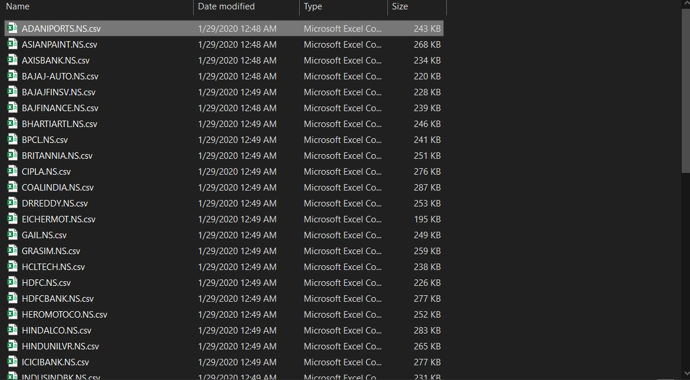
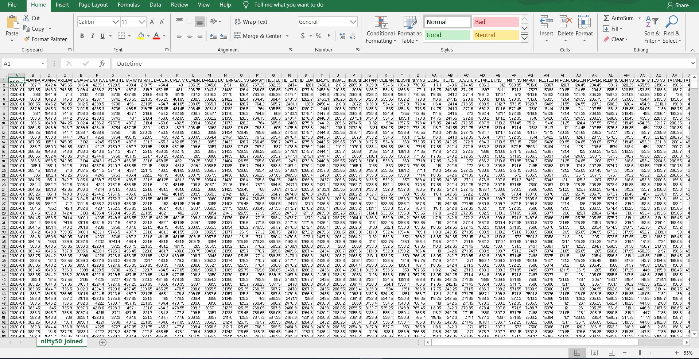
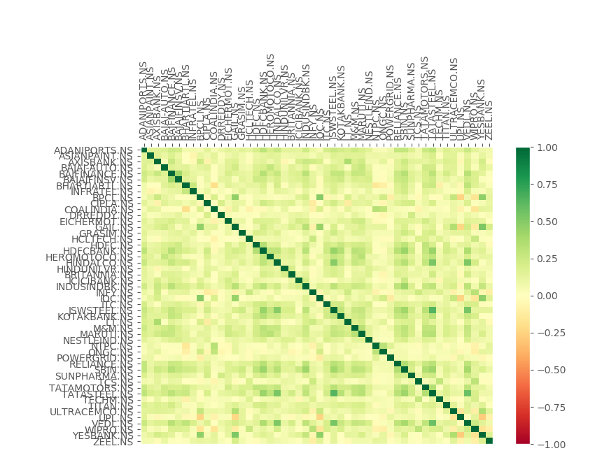

## Heatmap.py

#### After _save_nifty50_tickers()_

(base) C:\Users\THINK\Desktop\finalyearproject>python heatmap.py
['ADANIPORTS.NS\n', 'ASIANPAINT.NS', 'AXISBANK.NS', 'BAJAJ-AUTO.NS', 'BAJFINANCE.NS', 'BAJAJFINSV.NS', 'BHARTIARTL.NS', 'INFRATEL.NS',
'BPCL.NS', 'CIPLA.NS', 'COALINDIA.NS', 'DRREDDY.NS', 'EICHERMOT.NS', 'GAIL.NS', 'GRASIM.NS', 'HCLTECH.NS', 'HDFC.NS', 'HDFCBANK.NS',
'HEROMOTOCO.NS', 'HINDALCO.NS', 'HINDUNILVR.NS', 'BRITANNIA.NS', 'ICICIBANK.NS', 'INDUSINDBK.NS', 'INFY.NS', 'IOC.NS', 'ITC.NS', 
'JSWSTEEL.NS', 'KOTAKBANK.NS', 'LT.NS', 'M&M.NS', 'MARUTI.NS', 'NESTLEIND.NS', 'NTPC.NS', 'ONGC.NS', 'POWERGRID.NS', 'RELIANCE.NS',
'SBIN.NS', 'SUNPHARMA.NS', 'TCS.NS', 'TATAMOTORS.NS', 'TATASTEEL.NS', 'TECHM.NS', 'TITAN.NS', 'ULTRACEMCO.NS', 'UPL.NS', 'VEDL.NS',
'WIPRO.NS', 'YESBANK.NS', 'ZEEL.NS']

#### After _get_data_from_yahoo(relaod_nifty50 = False)_

#### After _compile_data()_

#### After _visualize_data()_

