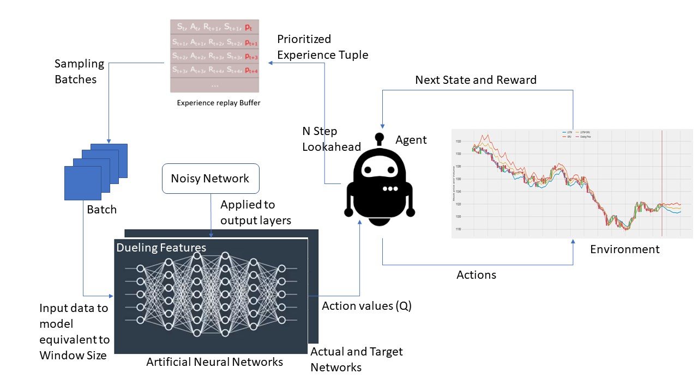

# Rainbow DQN Agent

This section of the repository contains an implmentation of Rainbow DQN Agent for predicting buy/sell signals on a stock trend. 

## Architecture



We were able to implement all the descendants of Rainbow DQN except Categorical DQN

- [x] Vanilla DQN
- [x] DQN with fixed target distribution
- [x] Double DQN
- [x] Prioritized Experience Replay
- [x] Dueling Network Architectures
- [x] Noisy Nets
- [x] Multi Step Reinforcement Learning
- [ ] Categorical DQN

## Data

You can download Historical Financial data from [Yahoo! Finance](https://ca.finance.yahoo.com/) for training, or even use some sample datasets already present under `data/`.

## Getting Started

In order to use this project, you'll need to install the required python packages:

```bash
pip install -r requirements.txt
```

Now you can open up a terminal and start training the agent:

```bash
python train.py data/GOOG.csv data/GOOG_2018.csv --strategy double-dqn
```

Once you're done training, run the evaluation script and let the agent make trading decisions:

```bash
python eval.py data/GOOG_2019.csv --model-name model_noisynstepperdddqn_20 --debug
```


## Acknowledgements

- [@pskrunner14](https://github.com/pskrunner14) for [Double DQN](https://github.com/pskrunner14/trading-bot) 
- [@LuEE-C](https://github.com/LuEE-C) for [NoisyDense Class](https://github.com/LuEE-C/NoisyDenseKeras)

## References

- [Rainbow: Combining Improvements in Deep Reinforcement Learning](https://arxiv.org/abs/1710.02298)
- [Neural Fitted Q Iteration – First Experiences with a data efficient Neural Reinforcement Learning Method](http://ml.informatik.uni-freiburg.de/former/_media/publications/rieecml05.pdf)
- [Prioritized Experience Replay](https://arxiv.org/abs/1511.05952)
- [Deep Reinforcement Learning with Double Q-learning](https://arxiv.org/abs/1509.06461)
- [Dueling Network Architectures for Deep Reinforcement Learning](https://arxiv.org/abs/1511.06581)
- [Noisy Networks for Exploration](https://arxiv.org/abs/1706.10295)
- [Multi-Step Reinforcement Learning: A Unifying Algorithm](https://arxiv.org/abs/1703.01327)
- [A Distributional Perspective on Reinforcement Learning](https://arxiv.org/pdf/1707.06887.pdf)